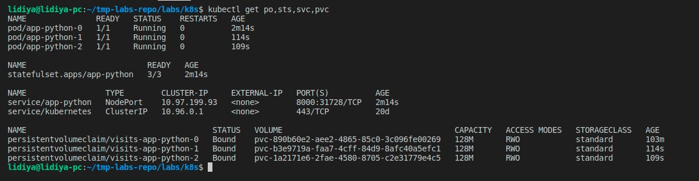
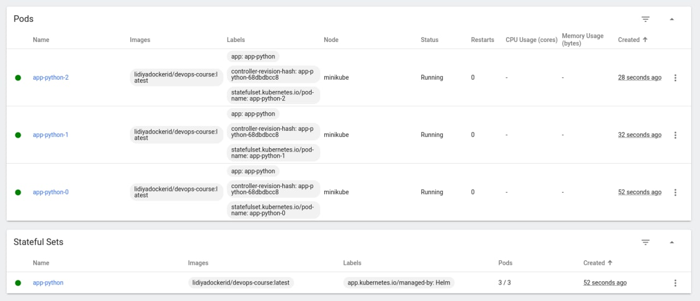
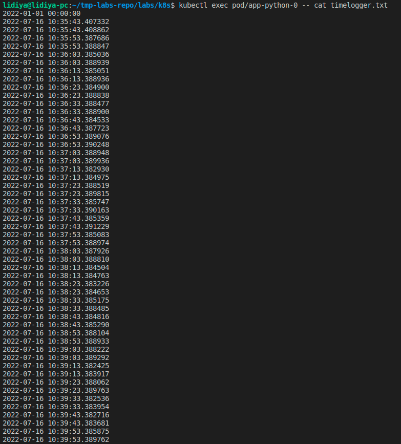
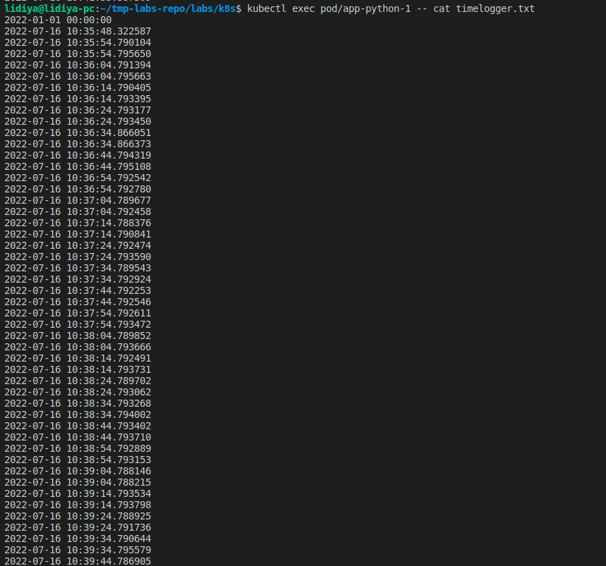
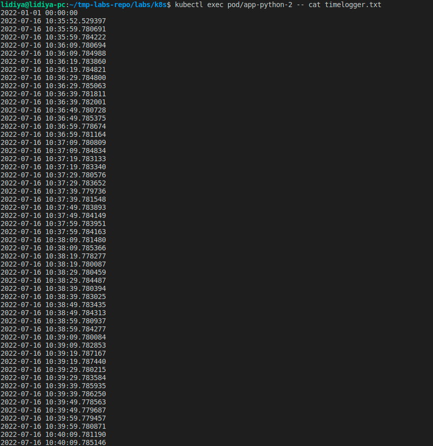
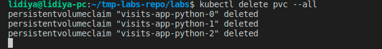

# kubectl get po,sts,svc,pvc



# minikube



# Logs







# Describe and explain in the report the differences between the output of the command for replicas

- Logs are different because each replica contains its own timelogger file. This means that they are fully independent from each other

# For our app ordering guarantee are unnecessary. Describe in the report why.

- It is also connected ot the previous question. It is not necessary to take into account the ordering since the reolicas are fully independent from each other

# Run command

```
lidiya@lidiya-pc:~/tmp-labs-repo/labs/k8s$ helm secrets install --dry-run --debug app-python app-python -n default -f app-python/secrets.yaml
install.go:178: [debug] Original chart version: ""
install.go:195: [debug] CHART PATH: /home/lidiya/tmp-labs-repo/labs/k8s/app-python

NAME: app-python
LAST DEPLOYED: Sat Jul 16 10:39:04 2022
NAMESPACE: default
STATUS: pending-install
REVISION: 1
USER-SUPPLIED VALUES:
secretkey: mysecret

COMPUTED VALUES:
affinity: {}
autoscaling:
enabled: false
maxReplicas: 100
minReplicas: 1
targetCPUUtilizationPercentage: 80
fullnameOverride: ""
image:
pullPolicy: IfNotPresent
repository: lidiyadockerid/devops-course
tag: latest
imagePullSecrets: []
ingress:
annotations: {}
className: ""
enabled: false
hosts:

- host: chart-example.local
  paths: - path: /
  pathType: ImplementationSpecific
  tls: []
  nameOverride: ""
  nodeSelector: {}
  podAnnotations: {}
  podManagementPolicy: Parallel
  podSecurityContext: {}
  replicaCount: 3
  resources: {}
  secretkey: mysecret
  securityContext: {}
  service:
  port: 8000
  type: NodePort
  serviceAccount:
  annotations: {}
  create: true
  name: ""
  statefulSet:
  name: visits
  storageSize: 128M
  tolerations: []

## HOOKS:

# Source: app-python/templates/tests/test-connection.yaml

apiVersion: v1
kind: Pod
metadata:
name: "app-python-test-connection"
labels:
helm.sh/chart: app-python-0.1.0
app.kubernetes.io/name: app-python
app.kubernetes.io/instance: app-python
app.kubernetes.io/version: "1.16.0"
app.kubernetes.io/managed-by: Helm
annotations:
"helm.sh/hook": test
spec:
containers: - name: wget
image: busybox
command: ['wget']
args: ['app-python:8000']
restartPolicy: Never
MANIFEST:

---

# Source: app-python/templates/serviceaccount.yaml

apiVersion: v1
kind: ServiceAccount
metadata:
name: app-python
labels:
helm.sh/chart: app-python-0.1.0
app.kubernetes.io/name: app-python
app.kubernetes.io/instance: app-python
app.kubernetes.io/version: "1.16.0"
app.kubernetes.io/managed-by: Helm

---

# Source: app-python/templates/secrets.yaml

apiVersion: v1
kind: Secret
metadata:
name: credentials
labels:
app: app-python-secret-helm
chart: "app-python-0.1.0"
release: "app-python"
heritage: "Helm"
type: Opaque
data:
secretkey: "bXlzZWNyZXQ="

---

# Source: app-python/templates/configmap.yaml

apiVersion: v1
kind: ConfigMap
metadata:
name: app-python-configmap
data:
config.json: '{
"somekey": "somevalue"
}
'

---

# Source: app-python/templates/service.yaml

apiVersion: v1
kind: Service
metadata:
name: app-python
labels:
helm.sh/chart: app-python-0.1.0
app.kubernetes.io/name: app-python
app.kubernetes.io/instance: app-python
app.kubernetes.io/version: "1.16.0"
app.kubernetes.io/managed-by: Helm
spec:
type: NodePort
ports: - port: 8000
targetPort: http
protocol: TCP
name: http
selector:
app.kubernetes.io/name: app-python
app.kubernetes.io/instance: app-python

---

# Source: app-python/templates/statefulset.yaml

apiVersion: apps/v1
kind: StatefulSet
metadata:
name: app-python
spec:
serviceName: app-python-service
replicas: 3
selector:
matchLabels:
app: app-python
template:
metadata:
labels:
app: app-python
spec:
containers: - name: app-python
securityContext:
{}
image: "lidiyadockerid/devops-course:latest"
imagePullPolicy: IfNotPresent
env: - name: SECRET_KEY
valueFrom:
secretKeyRef:
name: credentials
key: secretkey
ports: - name: http
containerPort: 8000
protocol: TCP
livenessProbe:
httpGet:
path: /
port: http
readinessProbe:
httpGet:
path: /
port: http
resources:
requests:
memory: "64Mi"
cpu: "900m"
limits:
memory: "128Mi"
cpu: "1000m"
volumeMounts: - name: config
mountPath: /config
readOnly: true - name: visits
mountPath: /app-python/
volumes: - name: config
configMap:
name: app-python-configmap
volumeClaimTemplates:

- metadata:
  name: visits
  spec:
  accessModes: [ "ReadWriteOnce" ]
  resources:
  requests:
  storage: 128M

NOTES:

1. Get the application URL by running these commands:
   export NODE_PORT=$(kubectl get --namespace default -o jsonpath="{.spec.ports[0].nodePort}" services app-python)
  export NODE_IP=$(kubectl get nodes --namespace default -o jsonpath="{.items[0].status.addresses[0].address}")
   echo http://$NODE_IP:$NODE_PORT
   removed 'app-python/secrets.yaml.dec'

```

# Delete pvc



# Update strategies - Bonus

There is the .spec.updateStrategy field which can be used to turn on and off automatic rolling updates (for examples when the container,label,resources limist are set for the statefulset). The default value for the updateStrategy is **RollinUpdate**. This means that it is an automated way to update the pods for a statefulset.

On the other hand, one is able to set **.spec.updateStrategy** field to **OnDelete** value. That will mean that the updates will not be updated automatically. You have to delete the pods you want to update. This will make the controller to create new pods and then they will be updated.
