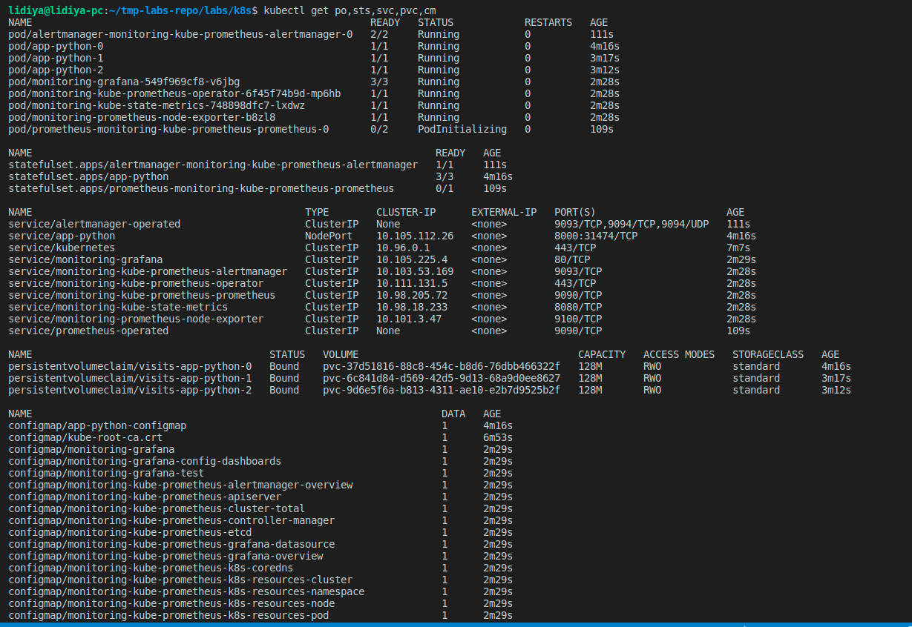
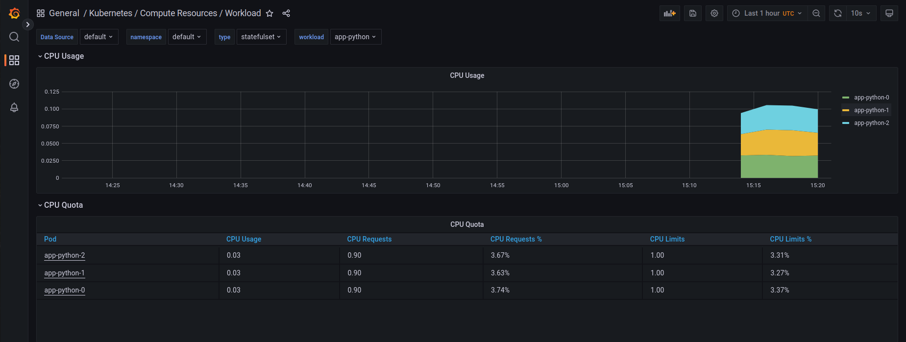
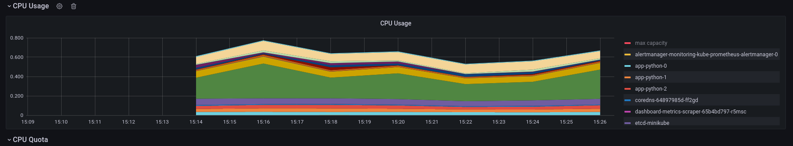
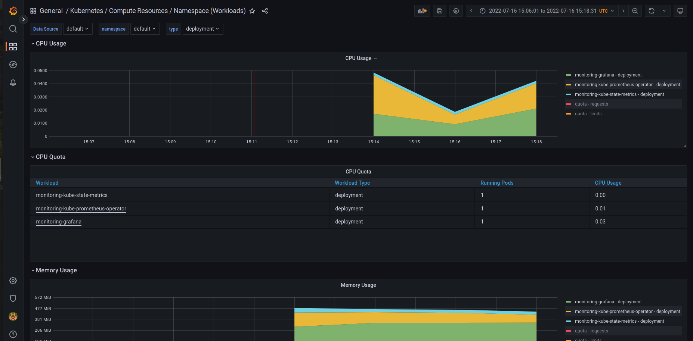
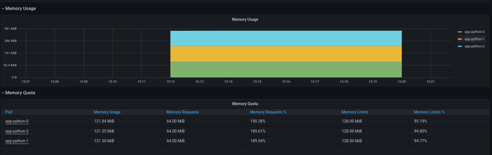
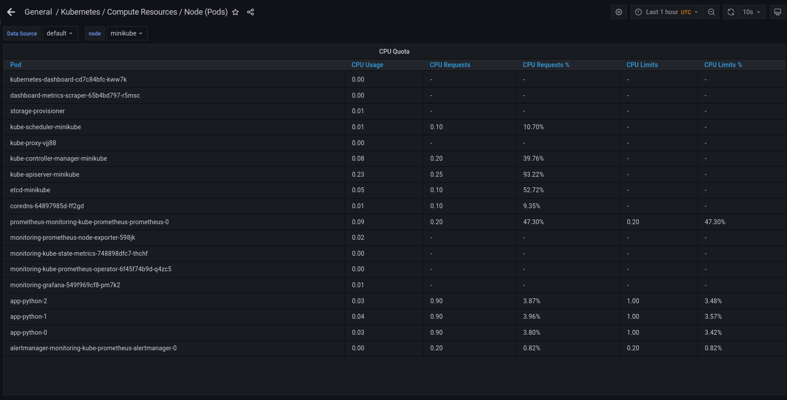
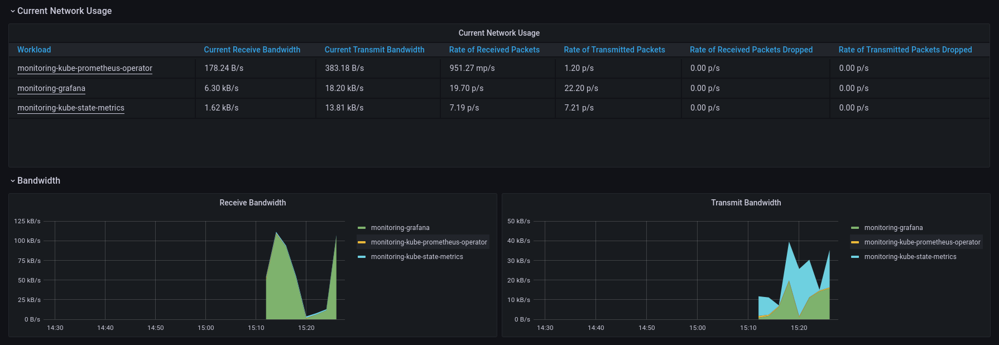
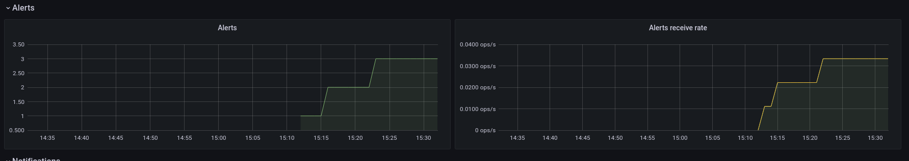

# Components

**Prometheus Operator** : it gives possibility to configure, deploy and manage prometheus components

**Highly available Prometheus** : store metrics, put them in database in time-series format (or also in key-value pair if preffered).

**Highly available Alertmanager** : operates and manages the alerts notifications which are received from various applications. The manager later groups, analyzes metrics and sends them to specific receivers

**Prometheus node-exporter**: it is able to process a lot of low-level metrics (hardware and kernel )

**Prometheus Adapter for Kubernetes Metrics APIs** : The adapter can be used to substitute already running Prometheus metrics server in order to collect only necessary metrics.

**kube-state-metrics** : generates metrics about objects state which is connected to Kubernetus API

**Grafana** : graphical tool in order to visualize metrics

# Description of get po, sts, svc, pvc, cm

The command gives information about running pods, stateful sets, services, persistens volume claims, configmaps respectively

For example, With this command we are able to identify which pods are running or crashing, so the states services names, ports, etc.

# CPU Usage

# Memory Usage

# Pods

# Network

# Alerts

