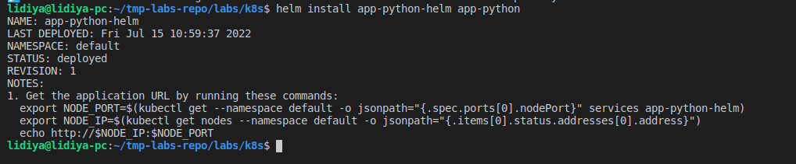
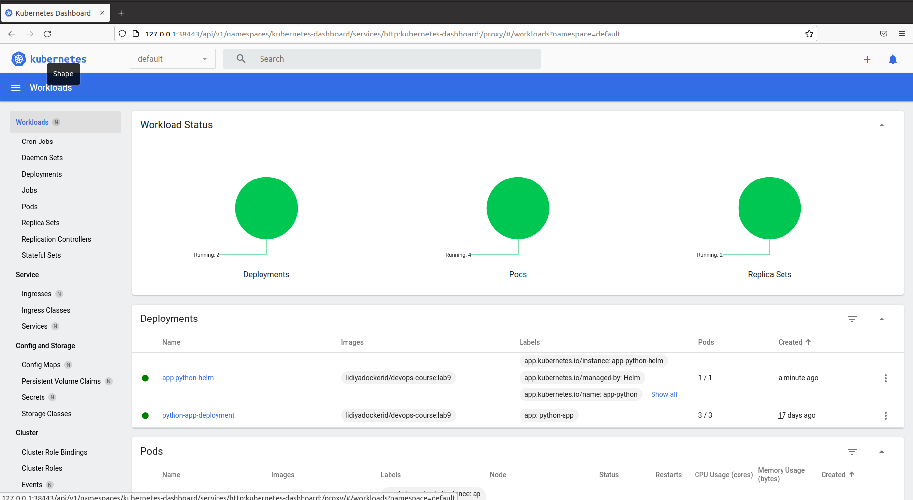
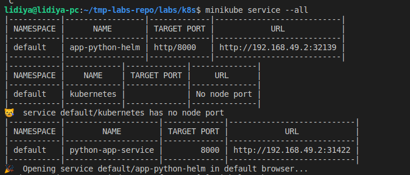
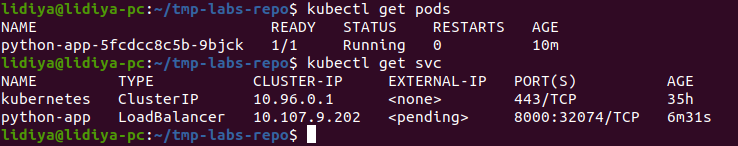
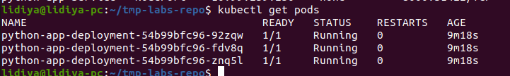
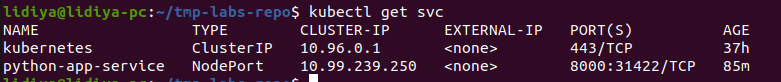
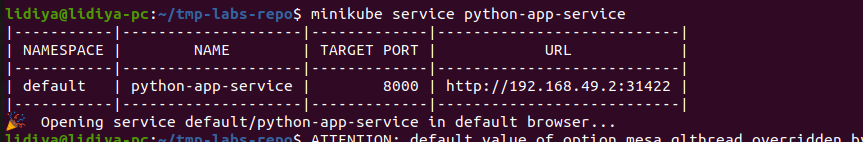
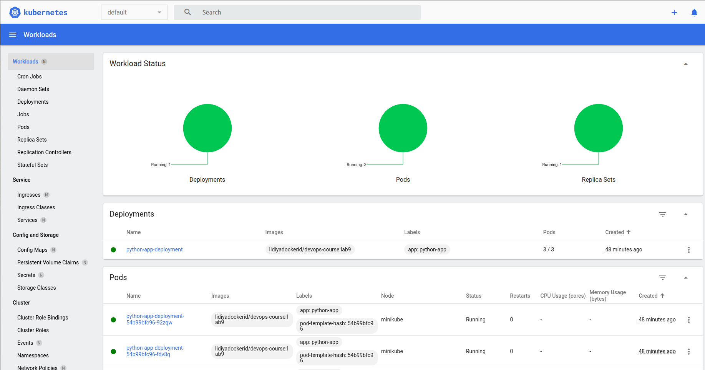
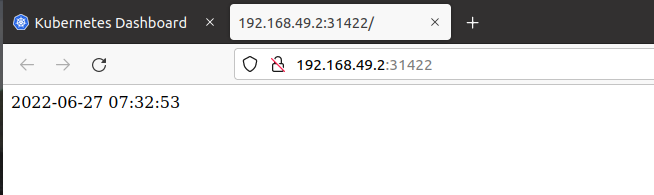

# Helm Lab 10

## Helm install

## Get pods, get svc

## Minikube dashboard

## Minikube service

# Lab 9

## Get pods, get svc

## Get pods, get svc after applying deployment.yml and service.yml

