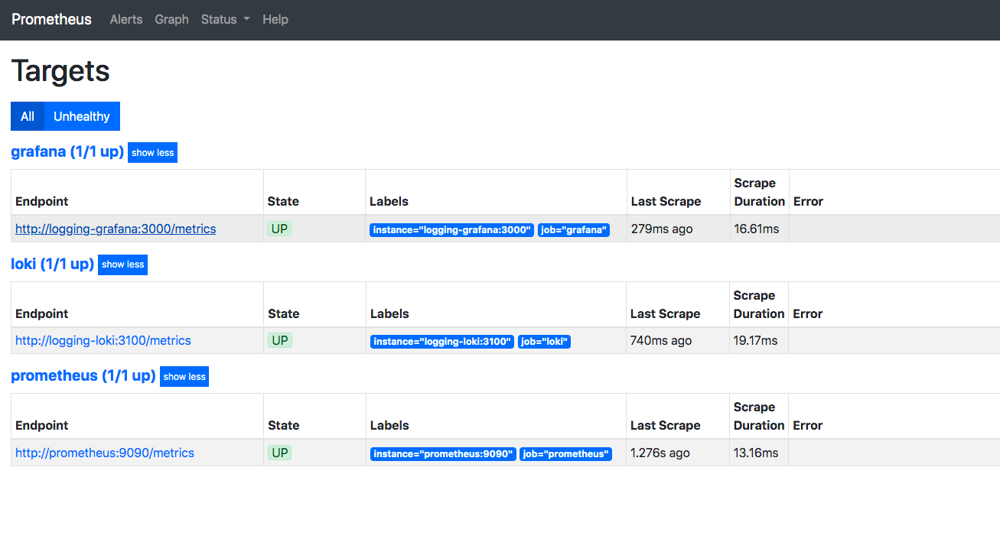
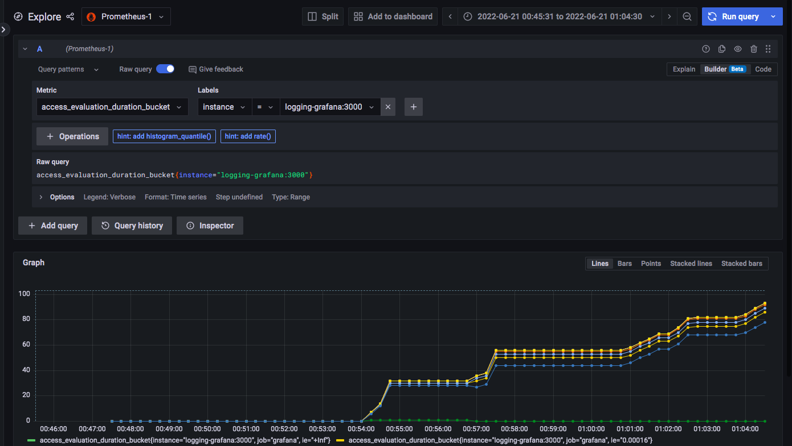
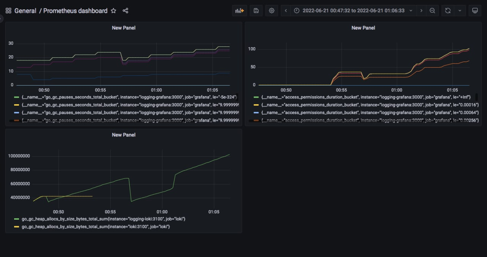
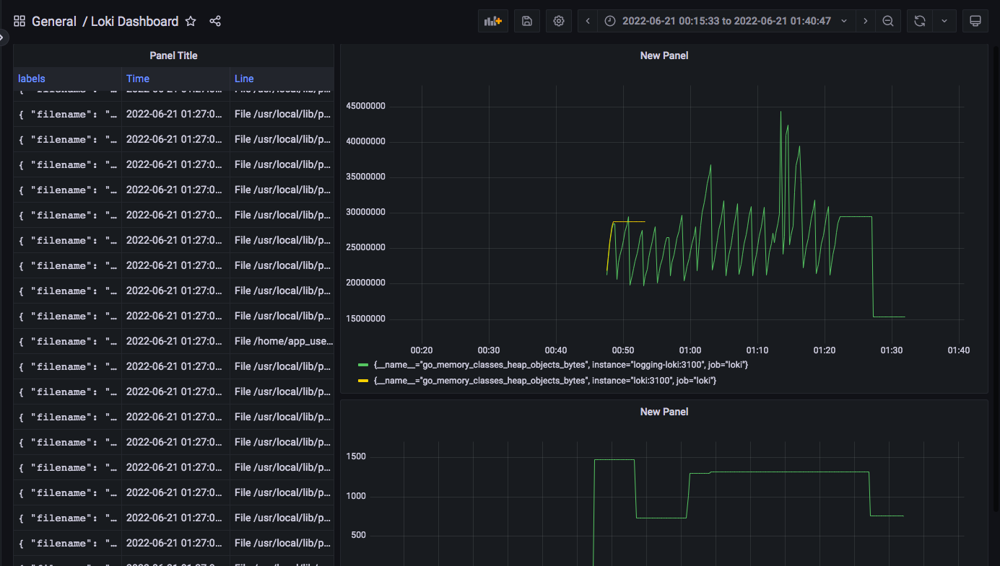

## Prometheus /target screenshot

- Used internal docker image names in order to make them accessible from prometheus
- Launch images in one network
- Add expose in docker compose
- Add prometheus tag version to .env

## Prometheus dashboard metrics

## Loki dashboard example

