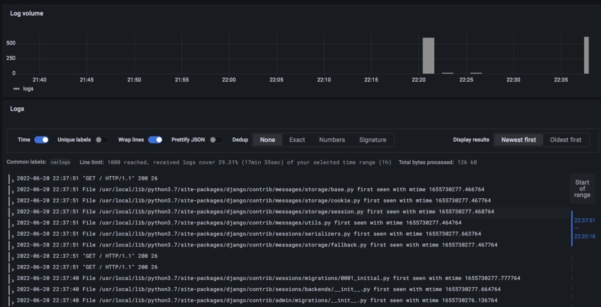

## Monitoring best practices

- Use .env variables to configure images names and tags
- Use regular expression to filter logs
- Time ordering of logs
- Label values must always be bounded
- Configure Cache and log size

